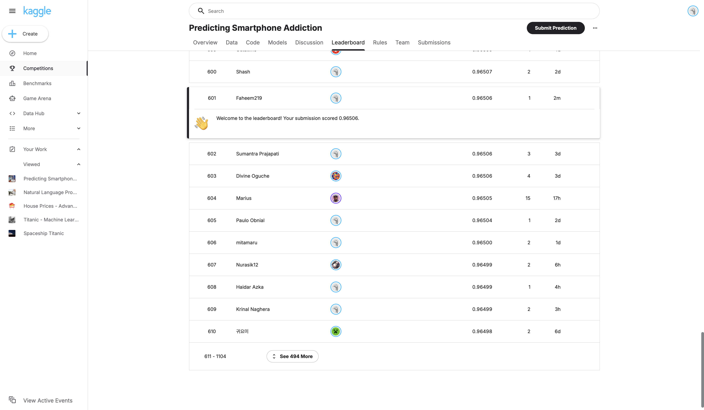
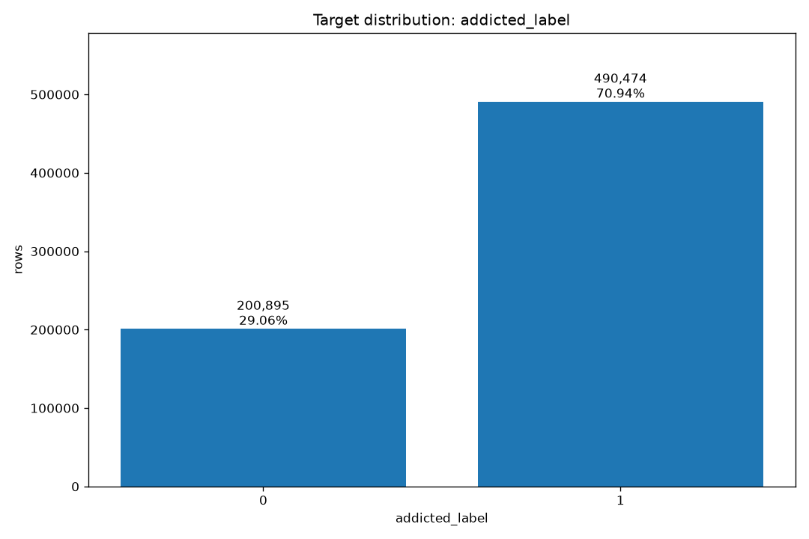
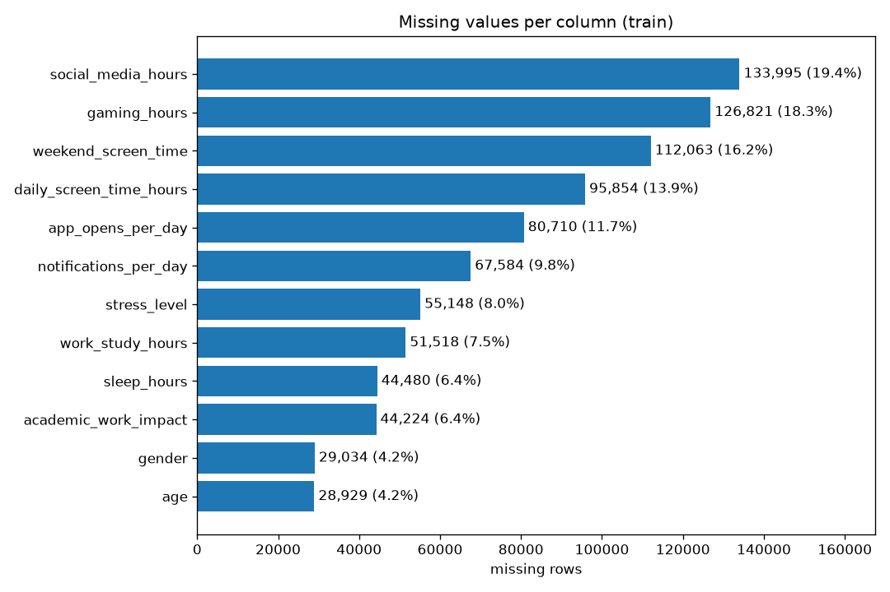
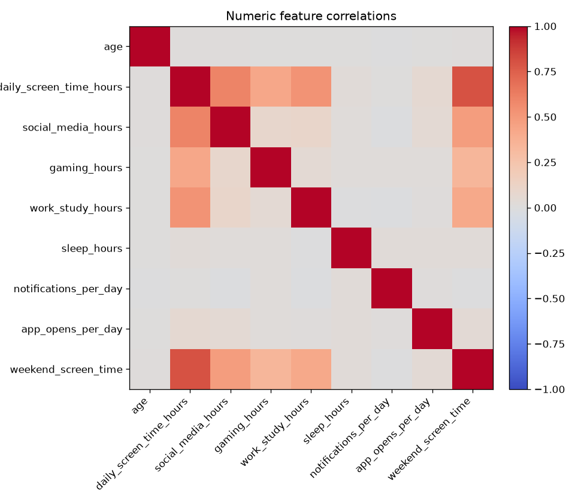
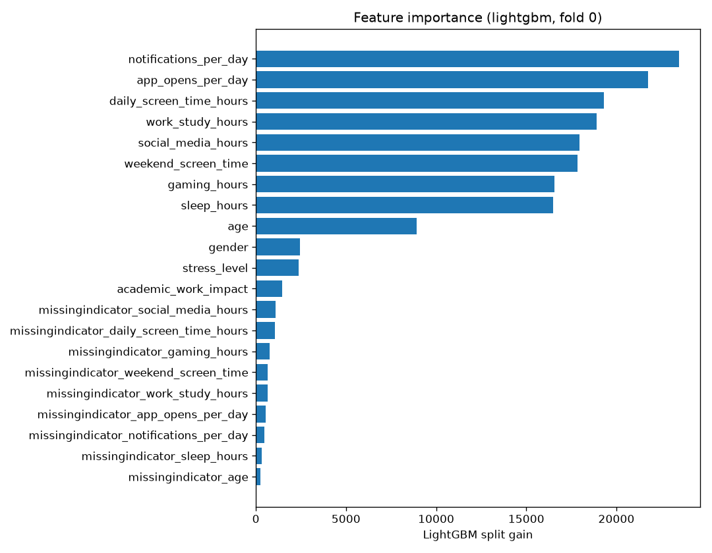

# smartphone-addiction-s6e8

Reproducible, containerised ML pipeline for Kaggle Playground Series S6E8, *Predicting
Smartphone Addiction*. Built as a DevOps course continuous assessment: three CLI stages,
one config file, 84 tests, CI on every push.

[](https://github.com/Faheem219/smartphone-addiction-s6e8/actions/workflows/ci.yml)

---

## Problem statement

Predict the probability that a user is labelled `addicted_label` from synthetic tabular
smartphone-usage features.

<https://www.kaggle.com/competitions/playground-series-s6e8>

| | |
|---|---|
| Task | Binary classification |
| Target | `addicted_label` &nbsp;·&nbsp; ID `id` |
| Metric | **ROC AUC** between the predicted probability and the observed target |
| Competition window | 1–31 August 2026; final submission deadline **31 August 2026, 23:59 UTC** |
| Train | 691,369 rows × 14 columns (43 MB) |
| Test | 296,302 rows × 13 columns (18 MB) |
| Features | 12 — 9 numeric, 3 categorical |
| Class balance | 490,474 positive / 200,895 negative → **70.94 % positive** |
| Missing values | present in **every** feature, 4.18 % (`age`) to 19.38 % (`social_media_hours`) |

> ### The submission holds probabilities, not labels
>
> The scored column is a **float in [0, 1]**, not a 0/1 prediction. A file of hard labels
> uploads cleanly, passes Kaggle's validation, and scores far worse — ROC AUC is computed
> from the *ranking* of predictions, and thresholding destroys exactly that information.
>
> The pipeline therefore carries probabilities end to end: `predict_proba(X)[:, 1]` for
> out-of-fold arrays, probability averaging for fold and model blending, and a float column
> in `submission.csv`. `src/predict.py` refuses to write a file whose target column has two
> or fewer distinct values. Kaggle's own `sample_submission.csv` corroborates the format —
> every row holds `0.7094243450313797`, which is precisely the training positive base rate.

## Quickstart

```bash
git clone https://github.com/Faheem219/smartphone-addiction-s6e8.git
cd smartphone-addiction-s6e8
make setup          # creates .venv with python3.11 and installs requirements.txt

# Download train.csv, test.csv and sample_submission.csv from
# https://www.kaggle.com/competitions/playground-series-s6e8/data
# and place all three in data/raw/

make all            # inspect -> train -> predict
```

Upload `submissions/submission.csv` to Kaggle. Nothing else needs to be submitted.

`make setup` requires Python 3.11 available as `python3.11`; on macOS, `brew install
python@3.11`. If LightGBM fails to import with a libomp error, `brew install libomp`.

Expect `make all` to take about **12.5 minutes** on a 10-core laptop CPU — 675.5 s of
training plus 68.8 s of inference. There is deliberately no wall-clock budget; see
[Reproducibility](#reproducibility).

Without the data in place, every stage fails with an actionable message rather than a
traceback:

```
Missing data/raw/train.csv.
Download the competition data from
https://www.kaggle.com/competitions/playground-series-s6e8/data
and place train.csv, test.csv and sample_submission.csv in data/raw/.
```

### All Make targets

```bash
make setup         # create venv, install requirements
make inspect       # derive the data contract -> reports/data_contract.md
make eda           # four figures -> reports/figures/*.png
make train         # K-fold CV -> models/, reports/metrics.json, reports/oof_predictions.csv
make predict       # inference -> submissions/submission.csv
make all           # inspect -> train -> predict
make test          # pytest (84 tests, no real data required)
make lint          # ruff check + ruff format --check
make fmt           # ruff format
make docker-build  # build the image
make docker-run    # run `make all` inside the container, artifacts bind-mounted back
make clean         # remove generated artifacts, never touches data/raw
```

## Project structure

```
smartphone-addiction-s6e8/
├── CLAUDE.md, Implementation Plan.md   # persistent project context and build spec
├── Makefile                            # every workflow is one target
├── Dockerfile, .dockerignore           # single-stage reproducible image
├── requirements.txt                    # minor-version pins
├── pyproject.toml                      # ruff + pytest config only, not pip-installable
├── config/
│   ├── default.yaml                    # every knob; no magic numbers in src/
│   └── ci.yaml                         # same pipeline, tiny budget, fixture-compatible
├── plans/                              # the seven phase specs this repo was built from
├── src/
│   ├── config.py                       # load + validate YAML, resolve paths
│   ├── contract.py                     # derive id/target/task-type from the data
│   ├── data.py                         # load, validate, CV splitter
│   ├── features.py                     # preprocessing ColumnTransformer
│   ├── models.py                       # model factory, weight normalisation
│   ├── metrics.py                      # metric registry + auto-resolution
│   ├── train.py                        # K-fold CV entrypoint
│   ├── predict.py                      # inference + submission guards
│   └── cli.py                          # argparse dispatch, logging setup
├── scripts/
│   ├── inspect_data.py                 # standalone contract report
│   └── make_eda.py                     # the four figures
├── tests/
│   ├── fixtures/                       # committed tiny CSVs + their seeded generator
│   ├── conftest.py                     # fixture-backed config factory
│   ├── test_contract.py, test_data.py, test_features.py
│   ├── test_models.py, test_metrics.py
│   └── test_smoke_pipeline.py          # end-to-end train->predict on both fixture sets
├── data/raw/                           # gitignored — you put the Kaggle CSVs here
├── models/                             # gitignored — fold estimators, preprocessor, contract
├── reports/
│   ├── data_contract.md                # committed evidence
│   ├── metrics.json                    # committed evidence
│   ├── leaderboard.png                 # committed evidence: the scored submission
│   ├── figures/*.png                   # committed evidence
│   └── oof_predictions.csv             # gitignored, ~44 MB
├── submissions/                        # gitignored
└── .github/workflows/ci.yml            # lint, format, tests, fixture pipeline run, docker
```

## Pipeline

```
data/raw/*.csv
      │
      ▼
 [inspect]  ── derives the data contract ──▶ reports/data_contract.md
      │
      ▼
 [train]    ── K-fold CV, fits N models ───▶ models/{model}_fold{k}.pkl
      │                                      models/preprocessor.pkl
      │                                      models/contract.json
      │                                      reports/metrics.json
      │                                      reports/oof_predictions.csv
      ▼
 [predict]  ── loads fold models, averages ▶ submissions/submission.csv
```

**The contract is derived, not hardcoded.** `src/` contains no `"id"` or `"addicted_label"`
literal. At runtime the ID and target names are read from `sample_submission.csv`'s first
two columns, the task type is inferred from the target's dtype and cardinality, and the
remaining columns are split numeric/categorical by dtype — with `config/default.yaml` able
to override any of it. This keeps the detection path exercised by the regression test
fixture (whose columns are `row_id` / `score`) and means a column rename upstream does not
break the pipeline.

**Preprocessing** is a `ColumnTransformer`: median imputation on the numeric branch, plus a
binary `missingindicator_*` column per numeric feature that had NaNs at fit time;
most-frequent imputation then ordinal encoding on the categorical branch, with unseen
categories mapped to `-1`. That widens 12 features to **21 columns**.

**The preprocessor is fitted once on the full training set** and reused across folds, rather
than refitted per fold. Median imputation and ordinal encoding are low-leakage — they
depend only on marginal distributions, not on the target — so the CV optimism this
introduces is negligible next to the simplicity of having a single persisted artifact that
`predict` can load. This is a deliberate trade, recorded here as required.

**Fold averaging.** Five folds per algorithm; each fold's model predicts the full test set
and the five probability vectors are averaged; the two algorithms are then blended 0.7 /
0.3. Averaging happens on probabilities, never on labels or ranks.

**Validation before writing.** `predict` builds the submission by copying
`sample_submission.csv` and overwriting only the target column — the IDs are never
re-derived from `test.csv` row order. It then asserts row count, column names, elementwise
ID equality, absence of nulls and infinities, the `[0, 1]` range, and that the column has
more than two distinct values. Any failure aborts the run.

## Results

Five-fold stratified CV, seed 42, metric ROC AUC. Numbers below are from
[`reports/metrics.json`](reports/metrics.json).

| Model | Fold scores | Mean | Std | Weight |
|---|---|---|---|---|
| `lightgbm` | 0.963055, 0.963784, 0.964075, 0.964577, 0.963542 | **0.963806** | 0.000510 | 0.7 |
| `hist_gbm` | 0.961649, 0.962876, 0.963263, 0.963892, 0.962434 | **0.962823** | 0.000758 | 0.3 |
| **Blend** | — | **0.963810** | — | — |

### Public leaderboard

| | |
|---|---|
| Public score | **0.96506** |
| Rank | **601 of 1104** |
| Entries | 1 |



<sub>Public leaderboard, captured 8 August 2026 immediately after the submission scored.
Note how tightly packed this region is: ranks 600 to 610 span 0.96507 down to 0.96498.</sub>

**The leaderboard score is ~0.0013 *above* CV, which is expected rather than suspicious.**
Each out-of-fold prediction comes from a single model trained on 4/5 of the data, whereas
every test prediction is the average of five such models. Averaging reduces variance, so
the submitted ensemble is genuinely stronger than any individual fold model that the OOF
score measures. Fold-averaged submissions routinely beat their own CV for this reason.

For scale: the leaderboard around rank 601 is extremely compressed — ranks 600 to 610 span
0.96507 down to 0.96498, so roughly **1e-5 of AUC per rank position** in this region. Small
score differences translate into many rank positions here.

### Timings

| Stage | Wall clock |
|---|---|
| `train` (10 model-folds on 691,369 rows) | 675.5 s |
| `predict` (10 models × 296,302 rows) | 68.8 s |
| **`make all`** | **~12.5 min** |

Per-fold: LightGBM ~63–88 s, `hist_gbm` ~31–54 s. LightGBM's chosen iterations were
2794, 3188, 2805, 2972, 3442 against a 10,000 cap; `hist_gbm` used 941, 2072, 2004, 1607,
2201 against a 4,000 cap. Every fold stopped on its own — no fold was truncated by its cap.

> **CV is mildly optimistic by construction.** LightGBM's early-stopping iteration is chosen
> on the same validation fold that produces that fold's OOF score, so each fold's number is
> slightly favourable. It is left enabled because it is what prevents 10,000 trees from
> overfitting, and the effect is far smaller than the CV-to-leaderboard gap discussed above.
> Set `models[0].early_stopping_rounds: null` in `config/default.yaml` to remove it
> entirely, at the cost of a longer run.

### Figures

| | |
|---|---|
|  |  |
|  |  |

The importance plot is worth reading closely: the nine raw numeric features dominate, led by
`notifications_per_day` and `app_opens_per_day`; the three categoricals contribute modestly;
and **all nine `missingindicator_*` columns rank last**, each below the weakest real feature.
The missingness pattern is used but carries little signal — see
[Limitations](#limitations-and-future-work).

## DevOps practices used

Every practice below is a real file in this repository, not a description of intent.

| Practice | Where it lives |
|---|---|
| **Version-control hygiene** | [`.gitignore`](.gitignore) excludes `data/raw/*.csv`, `models/`, `submissions/*.csv` and the 44 MB `reports/oof_predictions.csv`; `.gitkeep` files preserve the directory tree. `git ls-files` shows no competition data and no model artifacts. |
| **Dependency pinning** | [`requirements.txt`](requirements.txt), minor-version pins (`pandas~=2.2`, `lightgbm~=4.7`, …). |
| **Lint and format gate** | `ruff` configured in [`pyproject.toml`](pyproject.toml) (line length 100, `E,F,I,UP,B`), run by `make lint` and enforced in CI as two separate steps. |
| **Unit tests** | [`tests/test_contract.py`](tests/test_contract.py), [`test_data.py`](tests/test_data.py), [`test_features.py`](tests/test_features.py), [`test_models.py`](tests/test_models.py), [`test_metrics.py`](tests/test_metrics.py) — 74 tests over contract derivation, loading errors, preprocessing, the model factory and the metric registry. |
| **End-to-end smoke testing** | [`tests/test_smoke_pipeline.py`](tests/test_smoke_pipeline.py) runs `run_train` then `run_predict` on committed fixtures for both the classification and regression paths, asserts the submission is a float probability column with more than two distinct values, and checks byte-level determinism. The whole suite passes with `data/raw/` empty. |
| **Test fixtures as code** | [`tests/fixtures/make_fixtures.py`](tests/fixtures/make_fixtures.py) regenerates the six committed CSVs deterministically, so the fixtures are reviewable and reproducible rather than opaque blobs. |
| **CI on every push** | [`.github/workflows/ci.yml`](.github/workflows/ci.yml): `build` runs lint, format check, the test suite, a full `inspect`→`train`→`predict` on the fixtures via `config/ci.yaml`, asserts the resulting submission holds probabilities, and uploads the artifacts; `docker` verifies the image still builds. |
| **Containerisation** | [`Dockerfile`](Dockerfile) on `python:3.11-slim` with `libgomp1` and `make`, a cached dependency layer, and a non-root `uid 1000` user. `make docker-run` bind-mounts `data/`, `models/`, `reports/` and `submissions/` and passes `--user $(id -u):$(id -g)` so the container writes as the host user. |
| **Build automation** | [`Makefile`](Makefile) — twelve `.PHONY` targets; `PY ?=` rather than `:=` specifically so the image can override it with `ENV PY=python`. |
| **Configuration as data** | [`config/default.yaml`](config/default.yaml) holds paths, seed, contract overrides, CV settings, metric, preprocessing and per-model hyperparameters. `config/ci.yaml` is the same schema at a CI-sized budget. `src/` contains no magic numbers. |
| **Reproducibility** | `project.seed: 42` threaded through the CV splitter and every estimator. Four independent host runs produced byte-identical submissions. |
| **Artifact management** | `reports/data_contract.md`, `reports/metrics.json`, `reports/figures/*.png` and the leaderboard screenshot at `reports/leaderboard.png` are committed as graded evidence; CI additionally uploads the generated ones per run as workflow artifacts. |
| **Observability** | Structured `logging` throughout, configured once in `src/cli.py`; per-fold progress with a live ETA, LightGBM's per-iteration output routed through Python logging so it carries the same timestamps, and a distribution summary of the written submission. `runtime.progress: false` collapses this to stage-level lines for CI. No `print()` anywhere in `src/`. |

## Reproducibility

**Seed.** `project.seed: 42` in `config/default.yaml`, passed to `StratifiedKFold`, both
estimators, and `hist_gbm`'s internal validation split. Changing it changes every number in
this README.

**Host determinism — byte-identical.** Four independent runs all produced
`submissions/submission.csv` with md5 `7c6e26eb7776d050f33b6fded19ffc6f`: a fresh
`predict` on existing models, a repeated `predict`, and two complete `make all` runs from
scratch. All 10 per-fold CV scores and every `best_iteration` matched exactly across them;
`reports/metrics.json` differed only in `runtime_seconds` and `fold_seconds`.

**Container determinism — same result, not the same bytes.** `make docker-run` reproduces
all 10 fold scores and all 5 `best_iteration` values exactly, **zero rows change rank
position**, and the ROC AUC delta against the host submission is exactly 0.0 — so the Kaggle
score is identical. The two files are nevertheless not byte-identical: 80.75 % of rows differ
by at most 1.5e-11, the last one to three digits of the float64 decimal representation. The
cause is floating-point summation order in a different libm/OpenMP build, not a different
thread count (the container saw the same 10 CPUs). No configuration setting removes it, and
because ROC AUC depends only on ranking, none is needed. Cross-platform byte-identity is not
an achievable or meaningful target for floating-point ML; host-to-host byte-identity is, and
it holds.

**Docker.**

```bash
make docker-build
make docker-run            # runs `make all` in the container against your data/
docker run --rm smartphone-addiction-s6e8 make test   # fast check, no data needed
```

**Hardware: CPU only, and deliberately so.** The pipeline runs multi-threaded on CPU via
`runtime.n_jobs: -1`. Apple MPS is not reachable from this stack — it is a PyTorch/Metal
backend, while LightGBM's GPU support is OpenCL/CUDA only (and its PyPI wheel is built
CPU-only) and scikit-learn is CPU-only by design. Reaching MPS would require adding `torch`
and a neural network, both out of scope. It would also not help: at ~691k rows × 21 columns
LightGBM's histogram algorithm is memory-bandwidth bound and saturates the performance cores
long before a GPU's transfer overhead would pay off. `models[].params.device` is exposed in
config so a GPU-enabled LightGBM build could be pointed at without touching `src/`.

**No wall-clock budget.** Training is sized for accuracy, not speed: 10,000-tree and
4,000-iteration caps with early stopping deciding where each fold actually ends. The measured
runtime is recorded in `reports/metrics.json` as `runtime_seconds`.

**Class imbalance is recorded and deliberately untouched.** At 70.94 % positive, no
resampling, SMOTE or `scale_pos_weight` is applied: ROC AUC is threshold-free and does not
benefit from rebalancing at this scope.

## Limitations and future work

- **The missing-value indicators earned less than expected.** Every feature carries
  4–19 % missing values, so `features.add_missing_indicators` was enabled on the theory that
  the missingness pattern is informative. The fold-0 importance plot shows all nine
  indicator columns ranking below every real feature. They are used, but marginally. No
  ablation run was done to isolate their AUC contribution — flipping the flag and re-running
  would settle it in about 12 minutes, and is the cleanest next experiment.
- **Only two model families with fixed hyperparameters.** No hyperparameter search, no
  stacking meta-learner, no target encoding — all deliberately out of scope. The blend
  weights (0.7 / 0.3) were chosen a priori rather than tuned; tuning them on out-of-fold
  predictions would fit the CV split, which is precisely the trap the fixed weights avoid.
  Given the ~1e-5-per-rank leaderboard compression, a principled weight search on a held-out
  split is the highest-value remaining lever.
- **Five folds, not ten.** Doubling the fold count would both tighten the CV estimate and
  strengthen the fold-averaged ensemble, at roughly double the training time. With no
  wall-clock limit, this is nearly free score.
- **The preprocessor is fitted on the full training set**, not per fold. Low-leakage but not
  zero-leakage; per-fold fitting would be more rigorous at the cost of five preprocessor
  artifacts instead of one.
- **No external data.** The competition points at an original source dataset; using it was
  out of scope for this assessment.

## Packaging for the college repository

Copy the project in as a subfolder. Use `git archive`, which exports exactly the committed
files — no competition data, no model artifacts, no caches, and no untracked scratch:

```bash
mkdir -p <college-repo>/smartphone-addiction-s6e8
git archive HEAD | tar -x -C <college-repo>/smartphone-addiction-s6e8/
```

That yields roughly 1 MB: source, tests and fixtures, config, Docker and CI definitions,
the phase specs, and the committed evidence in `reports/`. An `rsync` of the working tree is
*not* equivalent — it drags in `reports/oof_predictions.csv` (44 MB), `.pytest_cache/`,
`.ruff_cache/` and `.DS_Store` unless every one is excluded by hand.

> **CI does not run from the college-repo copy.** GitHub Actions only executes workflows
> located at `.github/workflows/` in the **repository root**. Once this project sits inside
> another repository as a subfolder, its workflow is inert there. The standalone repo
> <https://github.com/Faheem219/smartphone-addiction-s6e8> is therefore the canonical one —
> that is where CI runs, where the badge at the top of this file points, and where Actions
> screenshots should be taken from. The college repo receives a copy of the code.

### Assessment details

| Field | Value |
|---|---|
| Problem statement | <https://www.kaggle.com/competitions/playground-series-s6e8> |
| Submission date | 31 August 2026 (final submission deadline, 23:59 UTC) |
| Issue repository | <https://github.com/Faheem219/smartphone-addiction-s6e8> |
| GitHub name | `Faheem219` |
| GitHub assigned repo | `smartphone-addiction-s6e8/` inside the college repository |

## Licence

[MIT](LICENSE).
